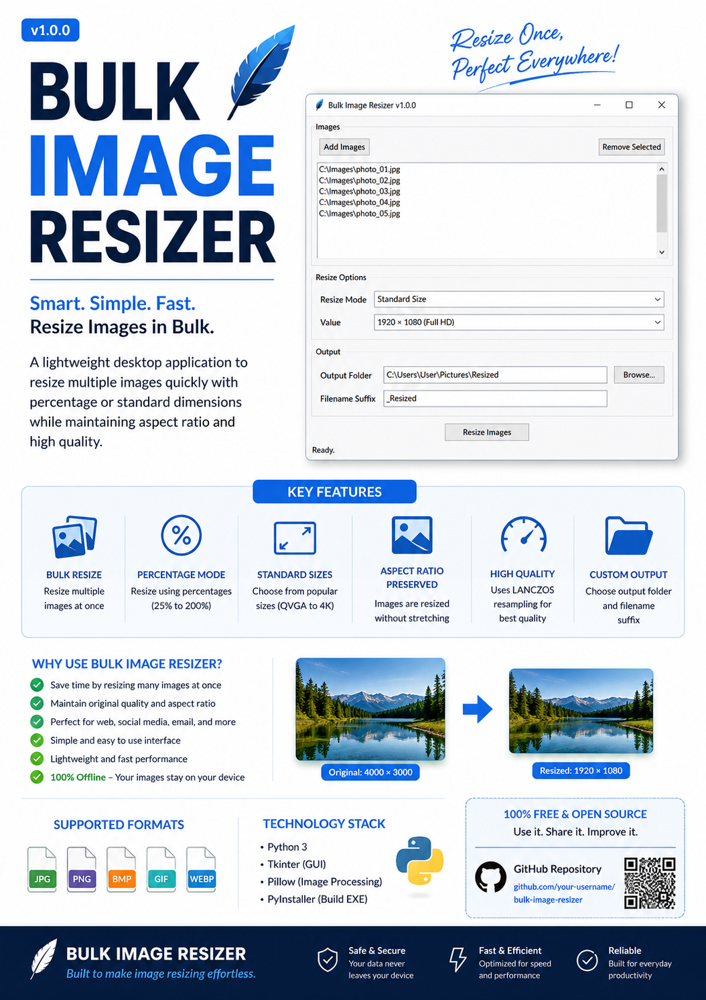

# Bulk Image Resizer

<p align="center">
  
</p>

---

## Overview

**Bulk Image Resizer** is a lightweight Windows desktop application that allows you to resize single or multiple images quickly while preserving aspect ratio and image quality.

Designed with simplicity in mind, the application focuses on the most common resizing needs without unnecessary complexity.

---

## Features

- Resize a single image or multiple images in one operation
- Resize by Percentage
- Resize using Standard Image Sizes
- Maintains original aspect ratio
- High-quality Lanczos resampling
- Batch processing
- Custom output folder selection
- Custom filename suffix
- Lightweight Tkinter GUI
- Standalone Windows executable
- Offline operation (no internet required)

---

## Screenshots

### Main Application

> *(Replace with an actual application screenshot later if desired.)*

<p align="center">
  
</p>

---

## Resize Modes

### Percentage

Resize images using predefined percentages.

Examples:

- 25%
- 50%
- 75%
- 80%
- 90%
- 100%
- 125%
- 150%
- 200%

---

### Standard Image Sizes

Resize images to fit within popular screen resolutions while maintaining aspect ratio.

Available presets:

- 320 × 240 (QVGA)
- 640 × 480 (VGA)
- 800 × 600 (SVGA)
- 1024 × 768 (XGA)
- 1280 × 720 (HD)
- 1366 × 768 (WXGA)
- 1600 × 900 (HD+)
- 1920 × 1080 (Full HD)
- 2560 × 1440 (2K)
- 3840 × 2160 (4K)

---

## Technology Stack

- Python 3.14
- Tkinter
- Pillow
- PyInstaller

---

## Project Structure

```text
bulk_image_resizer/
│
├── assets/
├── core/
├── gui/
├── screenshots/
├── tests/
│
├── main.py
├── settings.py
├── requirements.txt
├── README.md
└── LICENSE
```

---

## Installation

Clone the repository:

```bash
git clone https://github.com/dg-ganesh/bulk_image_resizer.git
```

Move into the project:

```bash
cd bulk_image_resizer
```

Install dependencies:

```bash
pip install -r requirements.txt
```

Run the application:

```bash
python main.py
```

---

## Windows Executable

The latest standalone Windows executable can be downloaded from the GitHub Releases page.

**Latest Release**

https://github.com/dg-ganesh/bulk_image_resizer/releases/latest

---

## Build Executable

Using PyInstaller:

```bash
pyinstaller --onefile --windowed --name "Bulk Image Resizer" main.py
```

---

## Future Roadmap

Version 1.0 intentionally focuses only on the core image resizing functionality.

Potential future enhancements include:

- Drag and Drop
- Image Preview
- Metadata Preservation Options
- Dark Theme
- Image Compression
- Watermark Support

---

## License

This project is released under the MIT License.

---

## Author

**DG Ganesh**

GitHub:

https://github.com/dg-ganesh

---

## Support

If you find this project useful, consider:

- Starring the repository
- Reporting issues
- Suggesting improvements
- Contributing to future versions

---

## Version

**Current Version:** **v1.0.0**